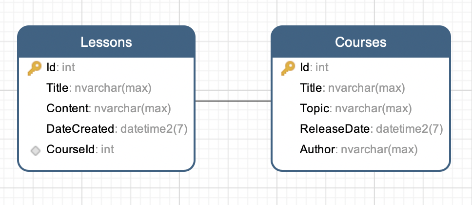
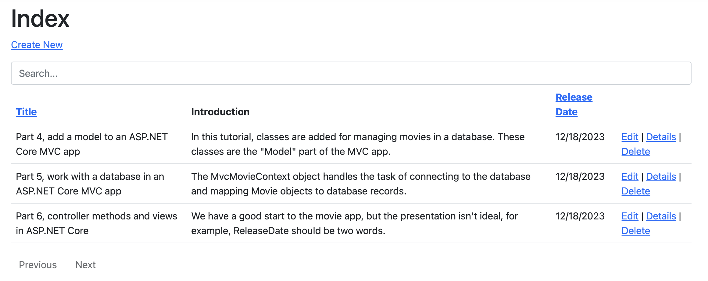
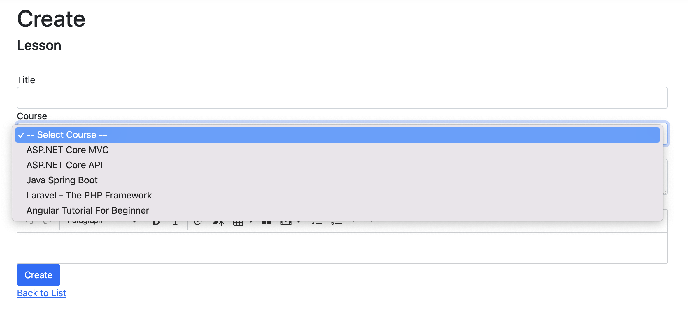
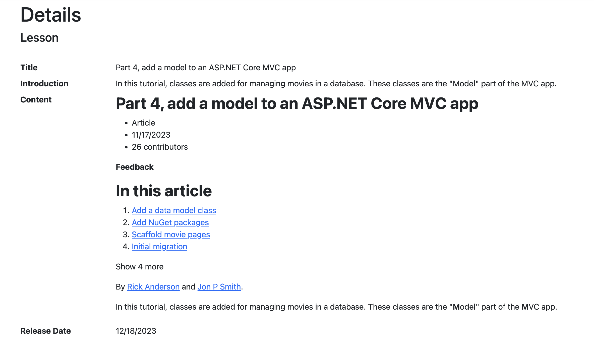
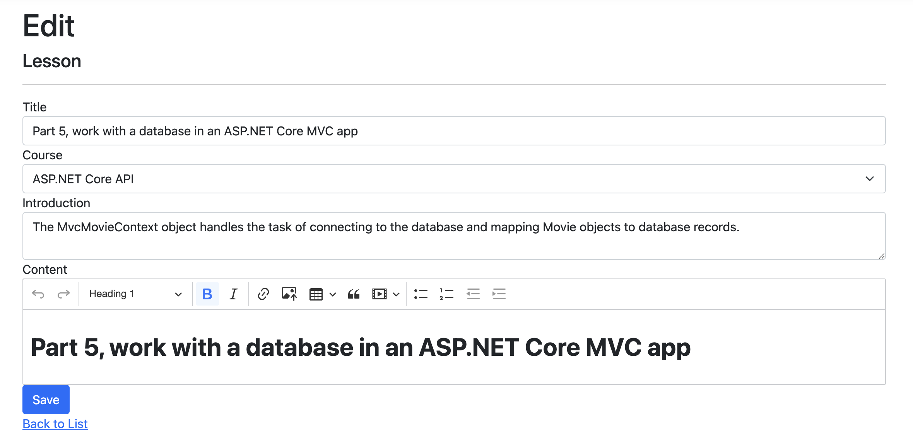
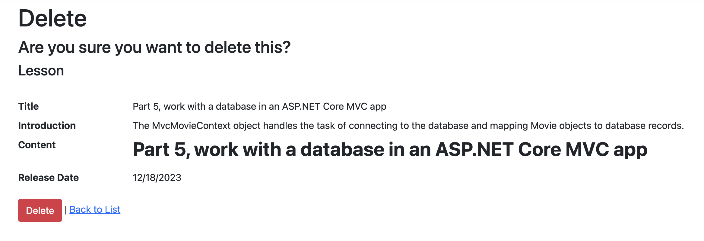

# Part 8: Introduction to relationships

>This document provides a simple introduction to the representation of relationships in object models and relational databases, including how EF Core maps between the two. This guide is compiled based on [Part 7: Get started with ASP.NET Core MVC](https://learn.microsoft.com/en-us/aspnet/core/tutorials/first-mvc-app/start-mvc?view=aspnetcore-8.0&tabs=visual-studio-code) by `Microsoft`.

In this section:

- Relationships in object models
- Relationships in relational databases
- Mapping relationships in EF Core
- Configuration in DbContext
- Find out more

Before coming to this guide, please refer to [Use dependency injection in .NET](https://github.com/NguyenPhuDuc307/search-sorting-pagination).

## Relationships in object models

A relationship defines how two entities relate to each other. For example, when modeling lessons in a course, each lesson is related to the course it is published on, and the blog is related to all the lessons published on that course.

In an object-oriented language like C#, the course and lesson are typically represented by two classes: Course and Lesson. For example:

```c#
using System.ComponentModel.DataAnnotations;

namespace CourseManagement.Data.Entities;

public class Course
{
    public int Id { get; set; }
    public string? Title { get; set; }
    public string? Topic { get; set; }
    [DataType(DataType.Date)]
    public DateTime ReleaseDate { get; set; }
    public string? Author { get; set; }
}
```

```c#
using System.ComponentModel.DataAnnotations;

namespace CourseManagement.Data.Entities;

public class Lesson
{
    public int Id { get; set; }
    public string? Title { get; set; }
    public string? Introduction { get; set; }
    public string? Content { get; set; }
    [DataType(DataType.Date)]
    public DateTime DateCreated { get; set; }
}
```

This connection from Course to Lesson and, inversely, from Lesson back to Course is known as a "relationship" in EF Core.

>**Important:** A single relationship can typically traversed in either direction. In this example, that is from Course to Lesson via the Course.Lessons property, and from Lesson back to Course via the Lesson.Course property. This is one relationship, not two.

## Mapping relationships in EF Core

EF Core relationship mapping is all about mapping the primary key/foreign key representation used in a relational database to the references between objects used in an object model.

In the most basic sense, this involves:

- Adding a primary key property to each entity type.
- Adding a foreign key property to one entity type.
- Associating the references between entity types with the primary and foreign keys to form a single relationship configuration.

Once this mapping is made, EF changes the foreign key values as needed when the references between objects change, and changes the references between objects as needed when the foreign key values change.

For example, the entity types shown above can updated with primary and foreign key properties:

```c#
using System.ComponentModel.DataAnnotations;

namespace CourseManagement.Data.Entities;

public class Course
{
    public int Id { get; set; }
    public string? Title { get; set; }
    public string? Topic { get; set; }
    [DataType(DataType.Date)]
    public DateTime ReleaseDate { get; set; }
    public string? Author { get; set; }

    public ICollection<Lesson>? Lessons { get; set; }
}
```

```c#
using System.ComponentModel.DataAnnotations;

namespace CourseManagement.Data.Entities;

public class Lesson
{
    public int Id { get; set; }
    public string? Title { get; set; }
    public string? Introduction { get; set; }
    public string? Content { get; set; }
    [DataType(DataType.Date)]
    public DateTime DateCreated { get; set; }

    public int CourseId { get; set; }
    public Course? Course { get; set; }
}
```

>**Tip:** Primary and foreign key properties don't need to be publicly visible properties of the entity type. However, even when the properties are hidden, it is important to recognize that they still exist in the EF model.

The primary key property of Course, Course.Id, and the foreign key property of Lesson, Lesson.CourseId, can then be associated with the references ("navigations") between the entity types (Course.Lessons and Lesson.Course). This is done automatically by EF when building a simple relationship like this, but can also be specified explicitly when overriding the OnModelCreating method of your DbContext. For example:

```C#
public class CourseConfiguration : IEntityTypeConfiguration<Course>
{
    public void Configure(EntityTypeBuilder<Course> builder)
    {
        builder.HasMany(e => e.Lessons)
        .WithOne(e => e.Course)
        .HasForeignKey(e => e.CourseId)
        .HasPrincipalKey(e => e.Id);
    }
}
```

Now all these properties will behave coherently together as a representation of a single relationship between Course and Blog.

## Configuration in DbContext

Update `Data/CourseDbContext.cs` with the following code:

```C#
using Microsoft.EntityFrameworkCore;
using CourseManagement.Data.Entities;

namespace CourseManagement.Data;

public class CourseDbContext : DbContext
{
    public CourseDbContext(DbContextOptions<CourseDbContext> options)
        : base(options)
    {

    }

    protected override void OnModelCreating(ModelBuilder modelBuilder)
    {
        modelBuilder.ApplyConfiguration(new CourseConfiguration());
    }

    public DbSet<Course> Courses { get; set; } = null!;
    public DbSet<Lesson> Lessons { get; set; } = null!;
}
```

Run the following .NET CLI commands:

```bash
dotnet ef migrations add AddLesson
```

```bash
dotnet ef database update
```

Open database diagram:



## Find out more

EF supports many different types of relationships, with many different ways these relationships can be represented and configured. To jump into examples for different kinds of relationships, see:

- [*One-to-many relationships*](https://learn.microsoft.com/en-us/ef/core/modeling/relationships/one-to-many), in which a single entity is associated with any number of other entities.
- [*One-to-one relationships*](https://learn.microsoft.com/en-us/ef/core/modeling/relationships/one-to-one), in which a single entity is associated with another single entity.
- [*Many-to-many relationships*](https://learn.microsoft.com/en-us/ef/core/modeling/relationships/many-to-many), in which any number of entities are associated with any number of other entities.

If you are new to EF, then trying the examples linked in in the bullet points above is a good way to get a feel for how relationships work.

To dig deeper into the properties of entity types involved in relationship mapping, see:

- [*Foreign and principal keys in relationships*](https://learn.microsoft.com/en-us/ef/core/modeling/relationships/foreign-and-principal-keys), which covers how foreign keys map to the database.
- [*Relationship navigations*](https://learn.microsoft.com/en-us/ef/core/modeling/relationships/navigations), which describes how navigations are layered over a foreign key to provide an object-oriented view of the relationship.

EF models are built using a combination of three mechanisms: conventions, mapping attributes, and the model builder API. Most of the examples show the model building API. To find out more about other options, see:

- [*Relationship conventions*](https://learn.microsoft.com/en-us/ef/core/modeling/relationships/conventions), which discover entity types, their properties, and the relationships between the types.
- [*Relationship mapping attributes*](https://learn.microsoft.com/en-us/ef/core/modeling/relationships/mapping-attributes), which can be used an alternative to the model building API for some aspects of relationship configuration.

>**Important:** The model-building API is the final source of truth for the EF model--it always takes precedence over configuration discovered by convention or specified by mapping attributes. It is also the only mechanism with full fidelity to configure every aspect of the EF model.

Other topics related to relationships include:

- [*Cascade deletes*](https://learn.microsoft.com/en-us/ef/core/saving/cascade-delete), which describe how related entities can be automatically deleted when SaveChanges or SaveChangesAsync is called.
- [*Owned entity types*](https://learn.microsoft.com/en-us/ef/core/modeling/owned-entities) use a special type of "owning" relationship that implies a stronger connection between the two types than the "normal" relationships discussed here. Many of the concepts described here for normal relationships are carried over to owned relationships. However, owned relationships also have their own special behaviors.

## Final, practice creating controller, view, view model for Lesson based on learned parts

- Create a `LessonsController.cs` with CRUD methods.
- Similar, create views for functions `Index`, `Create`, `Edit`, `Details` and `Delete`.
- Add `search`, `sorting`, `pagination`, `filter` by `CourseId`.

>**Note:** The create and edit methods must have the function of selecting a course from the list.

Page Lesson - Index:



Page Lesson - Add:



Page Lesson - Details:



Page Lesson - Edit:



Page Lesson - Delete:



Next let's [Part 9: File Storage in .NET](https://github.com/NguyenPhuDuc307/file-storage).
